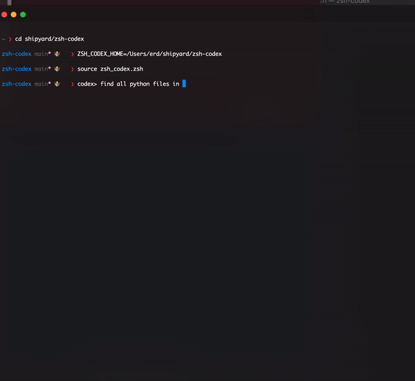

# zsh-codex

TODO: write docs

Simple usage

- Install python requirements by pip install -r requirements.txt
- set your api key using setup_codex_credentials --set,
- set root folder of where you put these files to ZSH_CODEX_HOME
- source zsh_codex.zsh

This is what I came up with in 2 hours after being inspired of excellent warp [terminal](https://www.warp.dev)

### LICENSE

MIT
